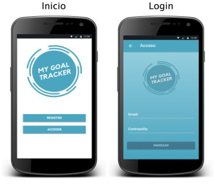
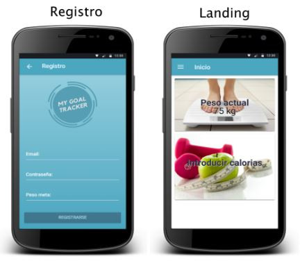
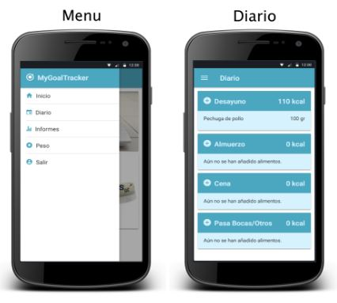
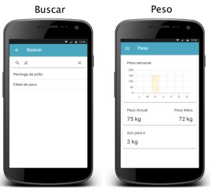
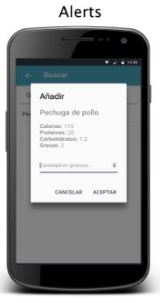

# MyGoalTracker
> Aplicación móvil para Android la cual permite monitorizar las calorías y el peso corporal con un seguimiento semanal y diario con el fin de alcanzar el peso deseado.

## Diseño

## Planteamiento del problema

El usuario, al registrarse en la aplicación, podrá introducir un peso meta inicial el cual se podrá modificar más adelante cuando vea oportuno.
En cuanto se haya alcanzado el peso meta, el usuario será notificado y podrá introducir un nuevo peso meta. Se podrá visualizar, mediante un diagrama de barras, el peso semanal del usuario. También aparecerá el peso actual junto al peso meta establecido y los ‘kg’ que quedan para conseguir el objetivo.
Se incluirá un apartado en el que se mostrará los alimentos consumidos en cada comida (desayuno,almuerzo,cena,pasabocas). También aparecerán las calorías totales consumidas en cada comida y la cantidad en gramos por cada alimento.
Para buscar alimentos habrá un buscador el cual el usuario introducirá el alimento a buscar, una vez haya finalizado la búsqueda, aparecerán los resultados debajo del buscador en los cuales el usuario selecciona uno y le aparece una ventana en la cual aparece la información nutricional, una vez el usuario la visualice procederá a introducir la cantidad que haya consumido de tal alimento. 
En el apartado ‘informes’ se visualiza mediante un diagrama de barras las calorías semanales por día, a continuación aparece un gráfico circular con las calorías diarias consumidas en cada comida.

## Tecnologías usadas

En cuanto a la arquitectura del proyecto se ha utilizado ‘Modelo-vista-controlador’ (MVC) ya que las tecnologías utilizadas manejan dicha arquitectura.
Para el desarrollo del proyecto se han utilizado principalmente dos tecnologías, una para el cliente y otra para la API, en la parte del cliente IONIC v3.20.0  y para la API se ha optado por SLIM v3. Como gestor de bases de datos se ha utilizado MariaDB v10.1.28.
IONIC utiliza como servidor web NodeJS v8.11.1 y Apache v2.4.
El entorno de desarrollo utilizado para desarrollar tanto la API como la aplicación cliente ha sido Atom v1.27.2. Para la administración de la base de datos se ha utilizado phpMyAdmin v4.7.4.
Para la representación de las estadísticas se ha utilizado ChartJS.

## Meta

Manuel Fernández de Ginzo – [LinkedIn](https://linkedin.com/in/manuelginzo/) – manuel.fdez.ginzo@gmail.com

